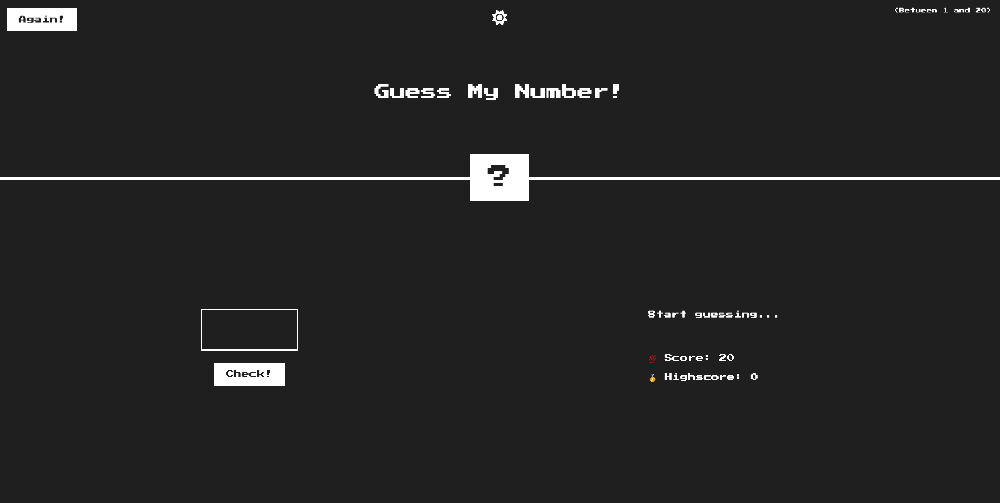
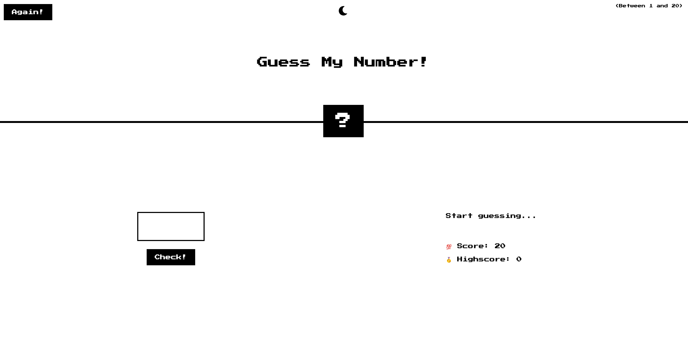
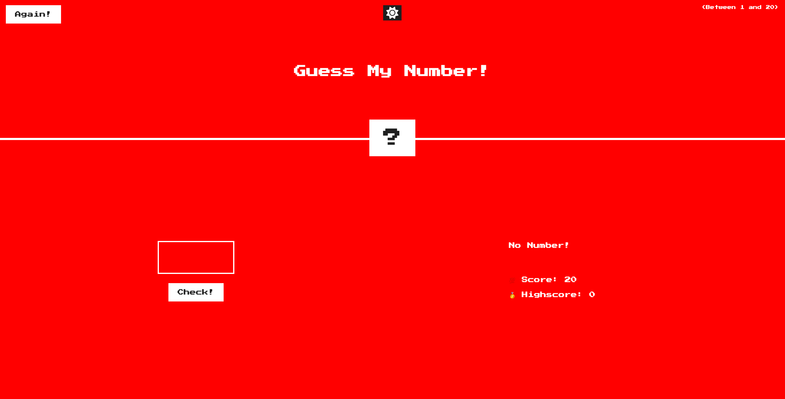
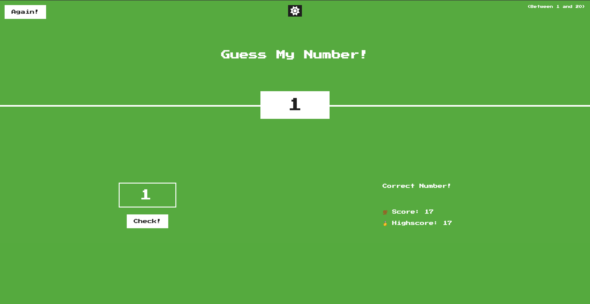

# Guess The Number - Vanilla Javascript

A simple vanilla JavaScript game where you guess a randomly generated number between 1 and 20. This project was inspired by a Udemy class and includes several enhancements beyond the original tutorial.

## Features

- **Basic Game Mechanics**: Guess the number and see if you’re correct!
- **Enhanced User Interface**: Added visual feedback and improved styling.
- **Red Background on No Input**: When the input field is empty and the "Check!" button is pressed, the background turns red.
- **Dark and Light Mode**: Toggle between dark and light themes using a button. Your preference is saved and applied on page reload.

## Project Structure

- `index.html`: The HTML structure of the game.
- `style.css`: The CSS file for styling the game, including dark and light themes.
- `script.js`: The JavaScript file handling game logic and theme switching.
- `theme.js`: A JavaScript module that manages the dark/light mode functionality.

## How to Run

1. **Clone the Repository**

   ```bash
   git clone https://github.com/yourusername/guess-the-number.git```

2. ***Navigate to the Project Directory**
   
   ```cd guess-the-number```

3. **Open `index.html`in your Browser**
   
   Simply open `index.html` file in a web browser to start playing


## How it Works

- `Game Logic`: The game generates a random number between 1 and 20, and the player attempts to guess it. Feedback is provided based on the guess, and the score is updated accordingly.
- `No Input Handling`: If the input field is empty when "Check!" is pressed, the background color changes to red to alert the user.
- `Theme Switching`: Use the button with a moon/sun icon to toggle between dark and light modes. The selected theme is saved in `localStorage` and applied on page load.

## Key Code Files

- `index.html`: The main HTML file includes the structure for the game and the theme toggle button.
- `style.css`: Handles the styling of the game and includes CSS variables for dark and light themes.
- `script.js`: Contains the game logic, including event listeners for guessing and resetting the game.
- `theme.js`: Manages theme switching functionality, including saving the theme preference in `localStorage` and updating the theme based on user interaction.

## Screenshots






## Known Issues

- Ensure that JavaScript is enabled in your browser for the game to function correctly.
- The theme toggle button may not work in some older browsers.

## License

- This project is licensed under the MIT License. See the LICENSE file for details.

## Acknowledgments

- Inspired by a Udemy class on JavaScript fundamentals.
- Font used: `Press Start 2P` from Google Fonts.


